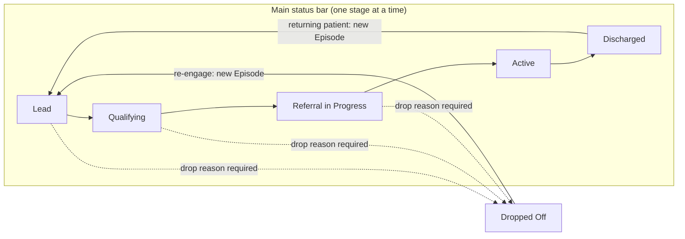
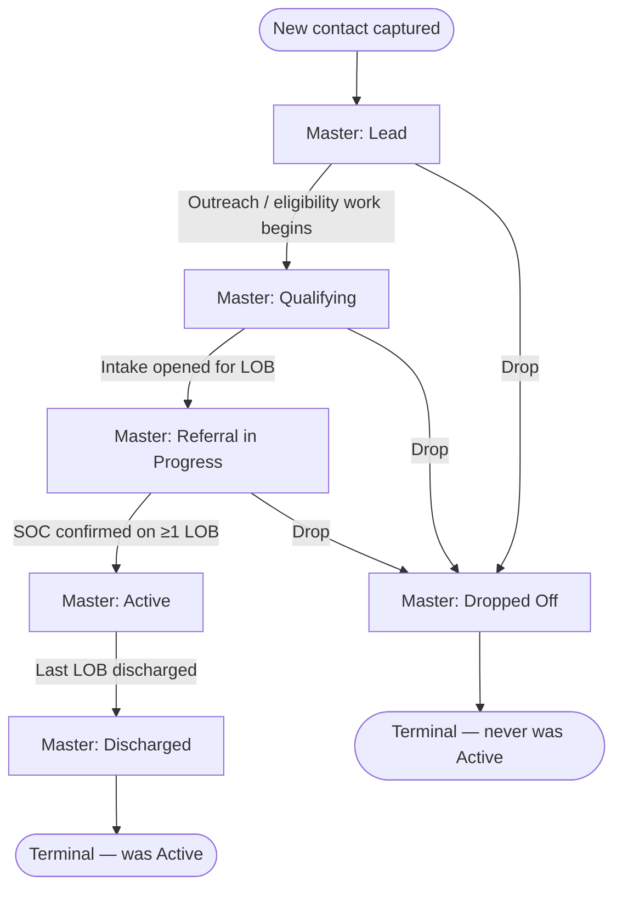
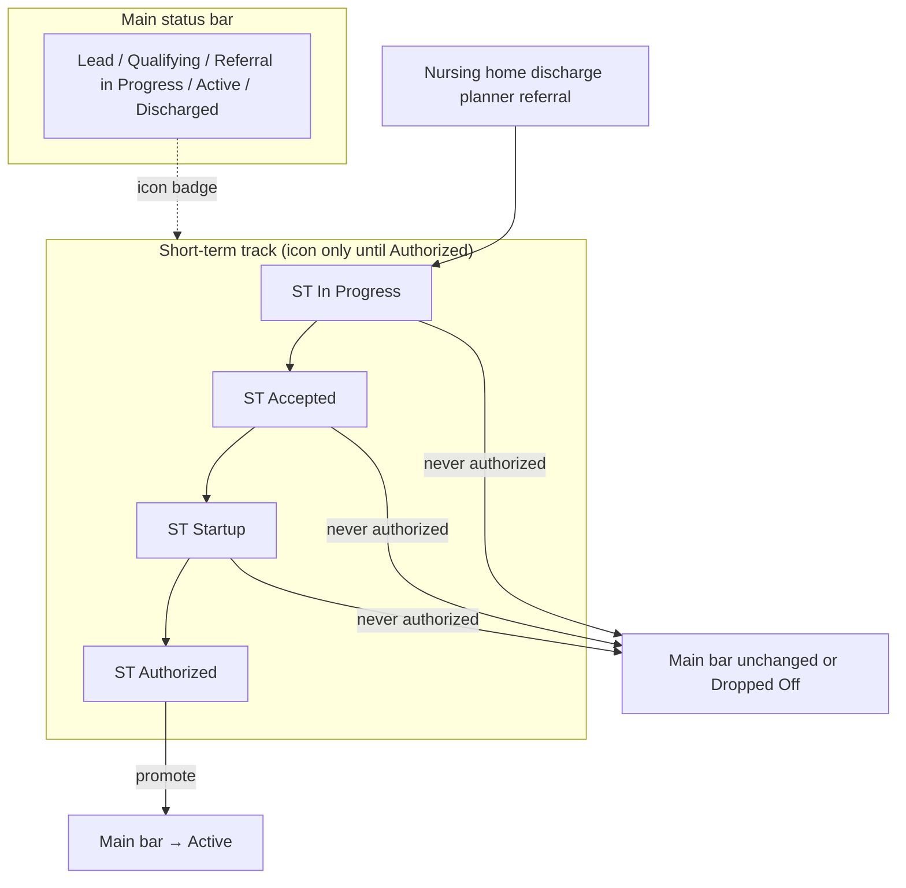
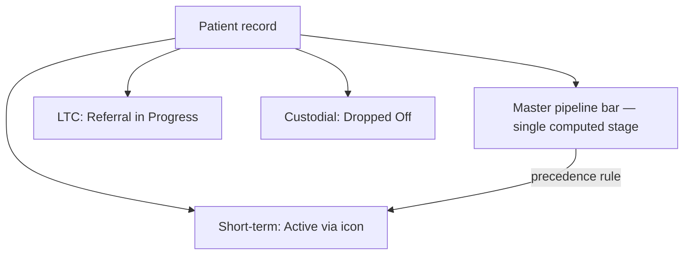
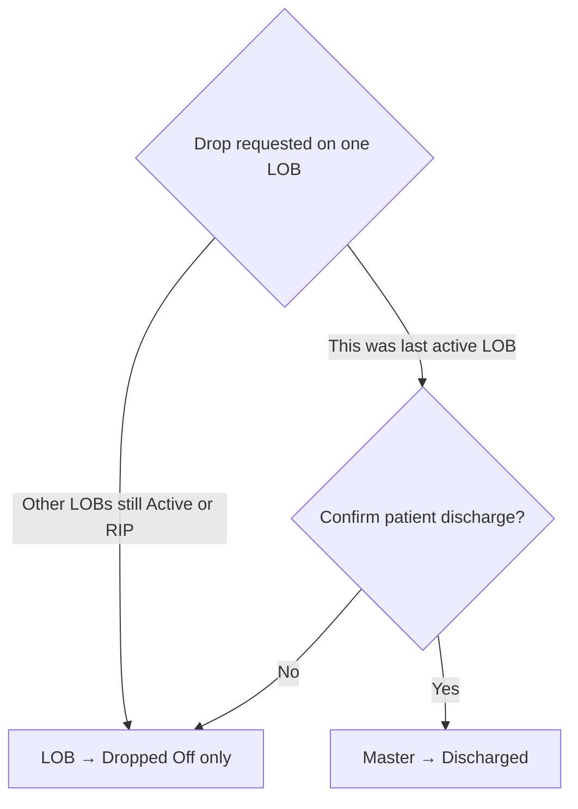
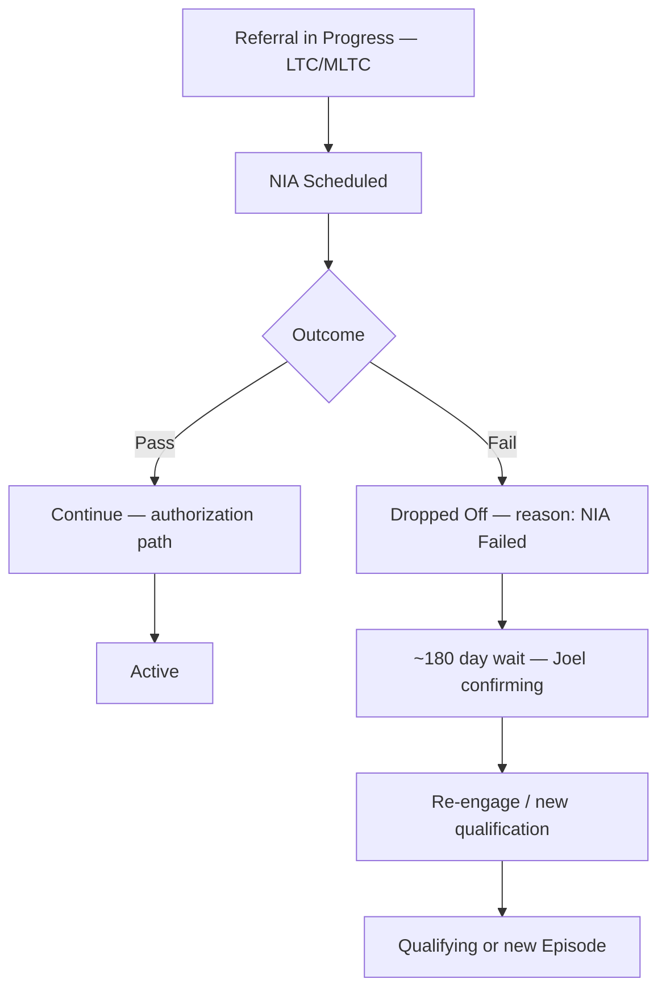

# Pipeline Flowcharts — Sign-Off Draft v1

**Prepared by:** Keren · **Sign-off:** Joel → Avi → Hillel (CEO) · cc Leah · **Status:** Pending sign-off  
**Pairs with:** [`glossary-pipeline-v2.md`](../glossary-pipeline-v2.md) · [`glossary/drop-reasons-for-signoff.md`](../glossary/drop-reasons-for-signoff.md)

**Gate:** Joel (ops) → Avi → Leah coordinates → Hillel (CEO) final — **only after these flowcharts are signed.**

---

## 1. Main patient pipeline

### 1.1 Linear flow



### 1.2 Decision rules



### 1.3 Stage entry checklist

| Stage | Enter when | Required data |
|-------|------------|---------------|
| **Lead** | Record created | Source, contact info, owner |
| **Qualifying** | Qualification started | Last contact date, insurance started |
| **Referral in Progress** | Intake opened | LOB, intake opened date, owner |
| **Active** | SOC confirmed | SOC date, LOB, coordinator *(confirm at sign-off)* |
| **Dropped Off** | Before Active exit | Drop reason (~10), date, owner |
| **Discharged** | After Active | Discharge reason, date, final service date |

---

## 2. Short-term care — parallel track + icon

Short-term does **not** appear on the main bar until **Short-Term Authorized**.

### 2.1 Parallel model



### 2.2 UI concept (wireframe)

```
┌─────────────────────────────────────────────────────────────┐
│  Jane Doe                                    [ST ◐] ← icon  │
├─────────────────────────────────────────────────────────────┤
│  MAIN:  Lead ──●── Qualifying ──○── Ref in Prog ──○── Active │
│         (progress bar — short-term NOT on this bar)           │
├─────────────────────────────────────────────────────────────┤
│  Short-term (icon tooltip): Accepted — CHHA limited hours   │
│  Does not count toward main pipeline metrics until Authorized│
└─────────────────────────────────────────────────────────────┘

When ST → Authorized:
  • Icon = filled / green
  • Main bar jumps to Active
  • Short-term appears in LOB list as active service line
```

### 2.3 Rules summary

| Situation | Main bar | Short-term icon |
|-----------|----------|-----------------|
| ST referral received, evaluating | Unchanged (often Qualifying or RIP) | In Progress |
| CHHA accepted, not yet serving | Unchanged | Accepted |
| Pre-service setup | Unchanged | Startup |
| ST services started | **Active** | Authorized |
| ST declined / patient refused | Dropped Off or prior stage | Hidden or Dropped |
| ST complete, no other LOB | Discharged or Dropped Off | Cleared |

---

## 3. Multi-LOB view

### 3.1 One patient, multiple lines



**Precedence (Assumption — Joel to confirm):** Master bar shows the **most advanced** stage among open gold LOBs (e.g. if LTC = Referral in Progress and Custodial = Active → master = **Active**).

### 3.2 UI concept (per-LOB panel)

```
┌─────────────────────────────────────────────────────────────┐
│  MASTER PIPELINE: Active (Authorized)                        │
│  Lead ── Qualifying ── Referral in Prog ── ● Active ── ○ Disc│
├─────────────────────────────────────────────────────────────┤
│  LINES OF BUSINESS                                           │
│  ┌──────────────┬──────────────────┬──────────┬────────────┐ │
│  │ LOB          │ Status           │ Auth     │ SOC        │ │
│  ├──────────────┼──────────────────┼──────────┼────────────┤ │
│  │ LTC          │ Referral in Prog │ Pending  │ —          │ │
│  │ Short-term   │ Active           │ Approved │ 2026-06-01 │ │
│  │ Custodial    │ Dropped Off      │ —        │ —          │ │
│  └──────────────┴──────────────────┴──────────┴────────────┘ │
│  Drop custodial ≠ discharge patient (LTC + ST still open)      │
└─────────────────────────────────────────────────────────────┘
```

### 3.3 LOB-level transitions

| LOB status | Meaning | Affects master bar? |
|------------|---------|---------------------|
| Not started | LOB identified, no intake | Only if sole LOB |
| Referral in Progress | Intake open for this LOB | Yes — if most advanced |
| Active | SOC on this LOB | Yes — drives master Active |
| Dropped Off | LOB attempt ended | Only if **last** open LOB |
| Discharged | LOB service ended | If last active LOB → master Discharged |

### 3.4 LOB drop vs patient discharge



---

## 4. NIA branch (LTC / MLTC path)



---

## 5. Sign-off

| Artifact | Signatory | Signed | Date |
|----------|-----------|--------|------|
| Main pipeline (§1) | Joel Schlanger (ops) | ☐ | |
| Short-term icon model (§2) | Joel Schlanger (ops) | ☐ | |
| Multi-LOB view (§3) | Joel Schlanger (ops) | ☐ | |
| NIA branch (§4) | Joel Schlanger (ops) | ☐ | |
| CRM implementation feasibility | Avi | ☐ | |
| **Executive approval** *(final)* | **Hillel (CEO)** | ☐ | |

**After gate complete (Joel → Avi → Leah → Hillel):**
1. Joel → schedule Avi CRM implementation review *(if not already held)*
2. Leah → coordinate calendar and team follow-up
3. One-pass CRM update proceeds — enrollment specialist dashboard work in build phase (§7 Dashboards)
