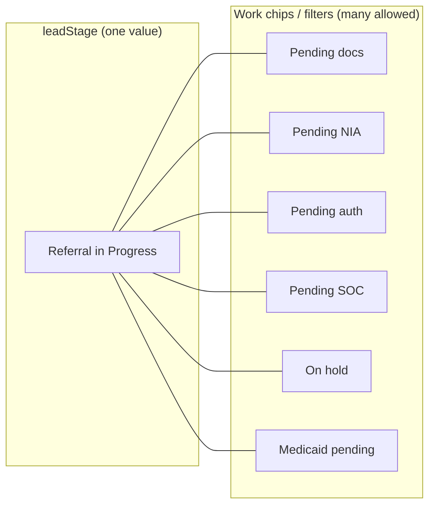

# Link Homecare CRM — Status Terminology & Pipeline Glossary

**Version:** 2.1 (sign-off draft)  
**Owner:** Keren Hapuch Lacadin  
**Operational review:** Joel Schlanger, Leah Adelman  
**Technical review:** Avi *(after this document + flowcharts signed)*  
**Status:** **Pending sign-off** — CRM implementation on hold until signed  
**Last updated:** July 6, 2026

**Companion artifacts:**
- **One-pager:** [`glossary/joel-model-signoff-onepager.md`](glossary/joel-model-signoff-onepager.md)
- Flowcharts: [`flowcharts/pipeline-flowcharts-v1.md`](flowcharts/pipeline-flowcharts-v1.md)
- Drop reasons (Joel sign-off): [`glossary/drop-reasons-for-signoff.md`](glossary/drop-reasons-for-signoff.md)
- Meeting notes: [`meeting-notes/2026-07-pipeline-alignment.md`](meeting-notes/2026-07-pipeline-alignment.md)

---

## Sign-off gate

| Role | Name | Signed | Date |
|------|------|--------|------|
| Framework | Keren Hapuch Lacadin | ☐ | |
| Operations | Joel Schlanger | ☐ | |
| Project coordination | Leah Adelman | ☐ | |
| CRM implementation | Avi | ☐ *(after tech review meeting)* | |

**When signed:** Joel schedules Avi tech review; Leah coordinates calendar. One-pass CRM update (labels + filters + backfill) may proceed.

---

## Legend

| Tag | Meaning |
|-----|---------|
| **Agreed** | Workshop consensus (Jul 2026) |
| **Known** | Confirmed in Nexus or prior discovery |
| **Assumption** | Recommended default — confirm at sign-off |
| **Retired** | Do not use for new records after cutover |

---

## 1. Master patient pipeline (Agreed)

The **main status bar** shows exactly one of these stages at a time (plus terminal Dropped Off):

```
Lead → Qualifying → Referral in Progress → Active → Discharged
                              │
                              └── Dropped Off (anytime before Active)
```

### Stage definitions

| Stage | Plain English | When to use | Who updates | Should NOT mean |
|-------|---------------|-------------|-------------|-----------------|
| **Lead** | Brand-new inquiry | Record created; little or no outreach yet | Growth, sales, enrollment | Active patient; authorized |
| **Qualifying** | Lead in progress | Contact started; insurance, diagnosis, and LOB eligibility being confirmed; **intake not yet opened** | Enrollment specialists | Referral in Progress; intake opened |
| **Referral in Progress** | Intake opened for a LOB | Enrollment opened intake and is processing patient for a specific line of business | Enrollment specialists, intake | Generic "in progress"; master label "Intake"; legacy "Converted" |
| **Active** | Receiving agency service | Patient is actively serviced under **at least one** LOB | Operations, enrollment | Authorized only; referral still being worked |
| **Discharged** | Left agency entirely | **No active LOBs remain**; patient ended relationship with Link | Operations | Dropped Off; temporary pause |
| **Dropped Off** | Never became Active | Opted out, ineligible, or failed qualification **before** first Active service | Enrollment specialists | Discharged; closed |

### Transition rules (Agreed)

| From | To | Trigger |
|------|-----|---------|
| Lead | Qualifying | First meaningful outreach or qualification work begins |
| Qualifying | Referral in Progress | Intake opened for a LOB |
| Referral in Progress | Active | Start of care confirmed on at least one LOB *(Assumption: SOC required — confirm at sign-off)* |
| Active | Discharged | Last active LOB ended; patient left agency |
| Lead, Qualifying, or Referral in Progress | Dropped Off | Terminal — requires **drop reason** (~10 categories) |
| Discharged | Lead or Qualifying | **New Episode** for returning patient *(Assumption)* |

**Agreed:** Dropped Off is **not** Discharged. Discharged requires patient was **Active** at least once.

**Agreed:** "Referral in Progress" replaces ambiguous **In Progress**, **Intake** (as master status), and legacy **Converted**.

---

## 1b. Referral substatuses (pre-Active funnel)

The **referral funnel** is everything before **Active**. It has two layers — do not collapse them into one picklist.

### Layer A — Referral funnel stages (`Episode.leadStage`)

These are the **primary referral substatuses** shown on the main progress bar and enrollment list views. Exactly one at a time.

| Substatus | Plain English | Entry trigger | Exit trigger |
|-----------|---------------|---------------|--------------|
| **Lead** | New inquiry; no qualification work yet | Record created | Outreach / screening begins |
| **Qualifying** | Lead in progress — contact, insurance, diagnosis, LOB fit | First meaningful outreach | Intake opened **or** Dropped Off |
| **Referral in Progress** | Intake open; working a specific LOB toward service | Intake opened for a LOB | SOC confirmed → Active **or** Dropped Off |
| **Dropped Off** | Terminal — never became Active | Drop decision at any pre-Active stage | Re-engage → new Episode at Lead or Qualifying |

```
Main bar (leadStage):  Lead → Qualifying → Referral in Progress → [Active]
                              └──────── Dropped Off ─────────────┘
```

**Legacy mapping (Nexus today → target):**

| Current `LeadStatus` | Target referral substatus |
|----------------------|---------------------------|
| — None — | Derive: Lead or Qualifying |
| New | **Lead** |
| In Progress | **Qualifying** or **Referral in Progress** *(split by whether intake is open)* |
| Converted | **Referral in Progress** *(retire Converted label)* |
| Dropped Off | **Dropped Off** |

**Agreed:** Enrollment specialists own updates to `leadStage` through Qualifying and Referral in Progress.

---

### Layer B — Work substeps (inside Referral in Progress)

When `leadStage` = **Referral in Progress**, the master bar **stays** Referral in Progress. Granular work state lives on **other layers** — shown as chips, intake fields, or dashboard filters — not as alternate master labels.

| Work substep | What it means | Lives on | Dashboard filter? |
|--------------|---------------|----------|-------------------|
| **Intake opened** | LOB intake created | Intake.status | Yes |
| **Pending documents** | Missing required paperwork | Intake tasks / checklist | Yes |
| **Pending NIA** | NIA not yet scheduled | `nia_status` on intake | Yes — enrollment priority |
| **NIA scheduled** | Appointments booked | `nia_status` | Yes |
| **NIA passed** | Eligible for MLTC path | `nia_status` | Yes |
| **Pending authorization** | Auth submitted, awaiting payer | Authorization.status | Yes |
| **Authorized — pending SOC** | Approved but service not started | Authorization + anticipated SOC | Yes — ops pipeline |
| **On hold** | Paused (NIA wait, vacation, docs) | `hold_reason` + `hold_until_date` | Yes — replaces Pre-Intake |
| **Pending Medicaid** | Medicaid app in flight | Medicaid ticket *(orthogonal badge)* | Yes — does not change leadStage |



**Rule:** Work substeps do **not** replace Referral in Progress on the main bar. Example: patient pending NIA is **Referral in Progress** + chip **Pending NIA** — not a separate master stage.

**Rule:** When SOC is confirmed → `leadStage` clears from referral funnel; `Episode.status` → **Active**.

---

### Layer C — Per-LOB referral substatus (multi-LOB)

When multiple LOBs are open, each LOB can sit at a different work substep. The **master** `leadStage` reflects the most advanced LOB *(Joel to confirm precedence)*.

| LOB-level substatus | Meaning |
|---------------------|---------|
| **Not started** | LOB identified; no intake |
| **Referral in Progress** | Intake open for this LOB |
| **Dropped Off** | This LOB attempt ended |
| *(Active / Discharged)* | *(Post-referral — on LOB row only)* |

Example: LTC = Referral in Progress (pending NIA); Short-term = Active via icon → master bar = **Active**.

---

### What is NOT a referral substatus

| Do not use as referral substatus | Use instead |
|----------------------------------|-------------|
| **Authorized** (top-level) | Active + Authorized chip |
| **Intake** (master label) | Referral in Progress + intake subprocess |
| **In Progress** (alone) | Qualifying or Referral in Progress |
| **Pre-Intake** | On hold + hold_reason |
| Short-term Accepted / Startup | Short-term **icon** track until ST Authorized |

---


When master stage = **Active**, show one chip:

| Chip | Meaning | Should NOT mean |
|------|---------|-----------------|
| **Authorized** | Valid payer authorization on at least one active LOB | Master pipeline stage |
| **Non-Authorized / Expired** | Active service but authorization missing or expired — ops follow-up | Dropped Off |

**Known:** Dashboard "authorized" count (~1,960) is unreliable; census uses Active + valid auth + SOC (~1,200–1,300).

---

## 3. Short-term care — parallel track (Agreed)

Short-term care is a **separate dimension**. It does **not** move the main status bar until the patient is **authorized for short-term service**.

| Concept | Rule |
|---------|------|
| **Primary source** | Nursing home discharge planners |
| **Services** | Nursing, PT, home health aide — typically 2 weeks to 3 months |
| **Main pipeline** | Unchanged until short-term **Authorized** |
| **UI** | Show via **distinct icon** — not main progress bar |
| **On short-term Authorized** | Main pipeline → **Active** |
| **If never authorized** | Main pipeline may stay Qualifying, Referral in Progress, or Dropped Off — short-term activity does **not** inflate pipeline metrics |

### Short-term LOB stages

| Stage | Meaning |
|-------|---------|
| **In Progress** | NH referral received; CHHA evaluating |
| **Accepted** | CHHA agrees to take patient; hours may be limited |
| **Startup** | Pre-service setup |
| **Authorized** | Receiving short-term services → **promote main status to Active** |

**Agreed (Joel):** Nursing home expects agency to accept referral; patient cooperation may be limited — track separately from main funnel scoring.

---

## 4. Multi-LOB view (Agreed)

Patients may have **multiple simultaneous** states across lines of business.

| Rule | Detail |
|------|--------|
| **Display** | Per-LOB row or chip: status, intake step, auth state |
| **Master bar** | Single stage reflecting **highest** forward progress on any gold LOB *(Assumption — Joel to confirm precedence)* |
| **LOB drop** | Dropping one LOB ≠ patient discharge unless **last** active LOB |
| **Enrollment work** | Specialists assign LOB and update per-LOB status from eligibility and intake data |

**Planned (Assumption):** UI "lights up" eligible LOBs as insurance + diagnosis entered — Phase 2 enhancement per Joel.

---

## 5. Line of business eligibility (Agreed framework)

Enrollment confirms eligibility at **Qualifying** and **Referral in Progress** before opening intakes.

| LOB | Eligibility summary | NIA required? |
|-----|---------------------|---------------|
| **MLTC / Long-Term Care** | Medicaid + qualifying diagnosis (dementia, brain injury, etc.) | **Yes** |
| **Custodial Care** | Medicaid + developmental delay diagnosis | Per program rules |
| **Short-Term / Skilled** | Skilled nursing need + Medicare/Medicaid | No |
| **NHTD** | Program-specific — Joel checklist | Per program |
| **OPWDD** | Program-specific — Joel checklist | Per program |
| **Private Pay** | Payer agreement — Joel checklist | No |
| **CDPAP** | **Retired** after Apr 1, 2025 sunset | N/A |

---

## 6. Intake, authorization, Medicaid (layers — not master status)

| Layer | What it answers | Object |
|-------|-----------------|--------|
| **Intake process** | Which LOB paperwork/assessments are in flight? | Intake |
| **Authorization** | What did payer approve, for what dates/hours? | Authorization |
| **Medicaid ticket** | Where is Medicaid application/eligibility? | Medicaid ticket *(orthogonal)* |
| **Start of Care (SOC)** | Confirmed first visit — gates Active *(Assumption)* | Intake / LOB date field |
| **Anticipated SOC** | Planned start before confirmation | Intake — warn if stale |

**Agreed:** Intake is **not** a master patient status. Use **Referral in Progress** at master layer when intake is open.

---

## 7. NIA — New York Independent Assessor (Agreed)

| Item | Detail |
|------|--------|
| **Purpose** | State assessment for MLTC / long-term care eligibility |
| **Process** | Two mandatory appointments (in person or Zoom) |
| **Pass** | Continue toward MLTC / LTC — stay Referral in Progress until Active |
| **Fail** | Typically **Dropped Off** (drop reason: NIA Failed) unless alternate LOB applies |
| **Appeals** | No limit on appeals |
| **Reapply wait** | **~180 days** minimum — **Joel to confirm** *(was 6 months in earlier draft)* |
| **CRM** | Track outcome; queue failed cases for follow-up after wait period |
| **Pre-Intake replacement** | Use follow-up/recycle date — not legacy Pre-Intake label |

---

## 8. Retired / deprecated terms

| Retired term | Use instead | Notes |
|--------------|-------------|-------|
| **Pre-Intake** | Qualifying or Referral in Progress + hold reason + follow-up date | Salesforce workaround |
| **Closed** | Dropped Off *(never Active)* or Discharged *(was Active)* | Manual split for legacy data |
| **Converted** | Qualifying or Referral in Progress | Legacy Salesforce |
| **Authorized** *(top-level)* | Active + Authorized chip | Caused census inflation |
| **In Progress** *(alone)* | **Qualifying** or **Referral in Progress** | Context-dependent |
| **Intake** *(as master status)* | Referral in Progress + Intake subprocess | |
| **Patient** *(as early-stage tag)* | Use pipeline stage | |

---

## 9. Enrollment specialist responsibilities (Agreed — Leah)

| Responsibility | Detail |
|----------------|--------|
| Update master pipeline stage | Based on contact, intake open, service start, drop, discharge |
| Confirm LOB eligibility | At Qualifying and Referral in Progress |
| Assign drop reasons | When moving to Dropped Off — use ~10 categories |
| NIA tracking | Prioritize upcoming/recent NIA; manage failed-NIA follow-up bucket |
| Dashboards | Use status, NIA, and LOB filters **when implemented** (§7 Dashboards — post-build) |

---

## 10. Nexus mapping (for Avi meeting — Assumption)

Business labels above map to Nexus **Episode** object. Proposed split:

| Business concept | Proposed Nexus home |
|------------------|---------------------|
| Lead → Qualifying → Referral in Progress → Dropped Off | `Episode.leadStage` *(expand picklist)* |
| Active / Discharged | `Episode.status` |
| Drop / discharge reason | `Episode.outcome` |
| Per-LOB state | Patient LOB fields + Intake |
| Short-term parallel | Dedicated ST fields + **icon** in UI |
| Authorized chip | Computed from Authorization |

**Do not build until this glossary + flowcharts are signed.**

---

## Open items (resolve at sign-off)

- [ ] Joel: Confirm NIA reapply wait (**180 days**?)
- [ ] Joel: Finalize NHTD, OPWDD, Private Pay eligibility checklists
- [ ] Joel: Sign [`glossary/drop-reasons-for-signoff.md`](glossary/drop-reasons-for-signoff.md)
- [ ] Joel: Confirm master bar precedence when multiple LOBs at different stages
- [ ] Joel: Confirm Active requires **confirmed SOC**
- [ ] Avi: Technical review — field mapping, one-pass migration plan

---

## Approval

By signing, reviewers agree this glossary is the business source of truth for CRM status implementation.

| Reviewer | Signature / initials | Date |
|----------|---------------------|------|
| Keren Hapuch Lacadin | | |
| Joel Schlanger | | |
| Leah Adelman | | |
